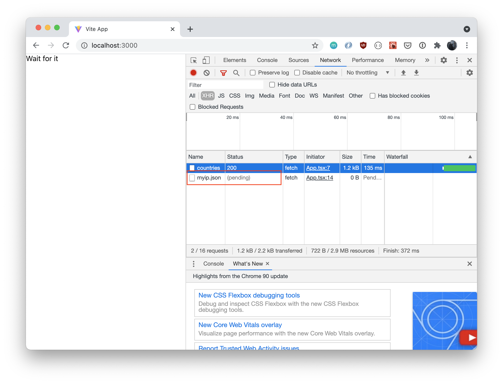

# Locator

This is a test project to reproduce the behavior in [pmndrs/jotai#443](https://github.com/pmndrs/jotai/issues/443) with jotai 0.16.3.

The app is pretty simple. On page load it makes 2 requests. One call to fetch a list of available countries, the second one to fetch the current location of the user (via [Lumtest](https://lumtest.com/myip.json). If the country of the user is part of the list it shows the name of the country. If it is not part of the list, it shows the United States.

It uses [React Suspense](https://reactjs.org/docs/concurrent-mode-suspense.html) to show a little message ("Wait for It"). The bug is reproduced when you only see the "Wait for it" message and you have an endless XHR request to https://lumtest/myip.json.



It is deployed on [Netlify](https://zen-hopper-4f6cf6.netlify.app) and the issue can be reproduced locally using [Vite](https://vitejs.dev):

```shell
yarn install
yarn dev
```

It can be reproduced with Jotai 0.16.2 and 0.16.3. Downgrading to 0.16.1 completely fixes the issue.
